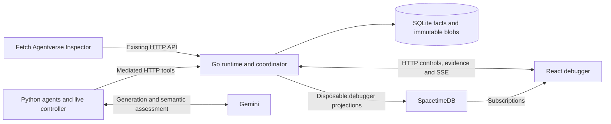

# Ravel

**A causal concurrency debugger for coding agents.** Ravel records what each agent observed, detects stale dependencies at publication, and helps you replay and repair the resulting artifacts without losing the original evidence.

## What Ravel Does

Concurrent agents can read an old schema, publish code after that schema changes, and pass the stale result to another agent. Ordinary logs show activity; they rarely establish which immutable input produced which output.

Ravel makes that chain inspectable:

**Agent execution → immutable observations and writes → causal provenance → hazard detection → semantic analysis → deterministic replay → repair → fresh immutable replacements.**

Observe mode allows a stale publication and exposes its impact. Guard mode rejects it so the agent can retry from fresh state. Successful repair can bring **active affected heads to 0** while preserving historical hazards, versions, and unsuccessful attempts.

## Demo

The sample has three agents: Backend reads an INTEGER schema and prepares types; Database changes the ID to UUID; Backend publishes from its stale observation; Frontend consumes those types.

1. Start the live app below, open **http://127.0.0.1:4317/**, and click **New Live Run**.
2. Choose **Deterministic Race Reproduction**, **Load Sample Scenario**, and **Observe**. The scheduler holds Backend's real write intent until Database finishes, then releases it through ordinary Go validation.
3. Inspect the timeline, input diff, causal graph, and immutable resource history. **Semantic analysis · Gemini** is interpretation alongside the runtime's deterministic evidence.
4. Click **Replay race** to step through recorded events; replay does not call agents again.
5. Click **Repair affected tasks**. Ravel derives the producing tasks and their order from provenance, then regenerates against current heads with fresh Gemini transcripts. Unsafe reuse of affected inputs is rejected; failed or incomplete repair remains visible and can be retried.
6. Inspect the new versions and **0 affected heads**. Enable **Include historical incidents** to retain the original incident in view. A fresh Guard run demonstrates rejected publication and fresh-attempt retry.

Other live modes: **Interactive** queues 2–6 editable agents and lets you start, pause, hold, release, and retry them individually; finish with **Finish run & analyze**. **Natural concurrency** starts the configured agents concurrently without forcing a race. Pause takes effect at a tool boundary; an agent both paused and held needs Resume and Release.

The local **Run scripted fixture** is a separate deterministic demo with no model calls. Live scheduling can reproduce an interleaving, but Gemini outputs, latency, and hazard outcomes are not guaranteed. A no-write or clean run is a valid result.

## Architecture



| Component                 | Language and responsibility                                                                                                                                                         |
| ------------------------- | ----------------------------------------------------------------------------------------------------------------------------------------------------------------------------------- |
| `runtime/`                | Go: authoritative execution, atomic validation/publication, immutable versions, observations, provenance, hazards, replay, repair restrictions, HTTP/SSE, SQLite and blob recovery. |
| `python/ravel/`           | Python: mediated client, Gemini transport, agent orchestration, live controller, provenance-driven repair planning, Inspector and benchmark tooling.                                |
| `apps/web/`               | TypeScript/React/Vite: timeline, causal graph, incident inspector, diffs, resource history, replay and live controls.                                                               |
| `packages/shared/`        | TypeScript/Zod: debugger/API contracts and validation used by the frontend. Python and Go have their own API implementations.                                                       |
| `integrations/spacetime/` | TypeScript SpacetimeDB module; Go publishes summaries and generated TypeScript bindings support browser subscriptions.                                                              |

Go owns concurrency and durable facts. Python makes provider calls outside runtime coordination. SpacetimeDB is a disposable read model; SQLite and SHA-256 blobs remain authoritative.

## Key Concepts

- **Immutable version:** a resource's recorded content, hash and generation. Its history survives head replacement.
- **Observation:** the exact version an attempt read, including matching repository-search results.
- **Publication/write:** a candidate validated against its captured observations and committed through Go.
- **Causal dependency:** a derivation edge from an observed input to a produced version.
- **Hazard:** evidence that an input was stale at publication, distinct from a model's correctness assessment.
- **Active affected head:** a current resource version reachable through stale derivation lineage.
- **Replay:** deterministic reconstruction and ordered playback of stored facts.
- **Repair:** new attempts linked by `repairOf`, with fresh source observations and restrictions on affected inputs.
- **Replacement version:** newly generated immutable output that supersedes a head with new provenance.

**Historical hazard ≠ active impact ≠ repair success.** A completed attempt alone does not prove repair. Identical regenerated bytes can still need a new immutable version because their provenance changed; ordinary identical writes remain no-ops. Version succession records history separately from derivation, so succession alone does not propagate stale impact.

## Getting Started

Prerequisites: **Go 1.26+**, **Python 3.11+**, **Node.js 22.18+**, and **pnpm 11.25.0**. SQLite is embedded. Core tooling and Gemini use Python's standard library; Fetch's optional SDK environment needs Python 3.12+.

```sh
pnpm install
```

Copy `.env.example` to ignored `.env` (PowerShell: `Copy-Item .env.example .env`). For the live demo, set `GEMINI_API_KEY` there. Start with `RAVEL_SPACETIME_ENABLED=false`; enable cloud projection after configuring it below.

```sh
pnpm demo:live
```

This typechecks/builds the frontend and Go executable, starts the Python controller, and serves the full app at **http://127.0.0.1:4317/**. The controller listens on loopback **4318**; the launcher wires its Go proxy automatically. Stop an existing server before rebuilding on Windows, where the running executable is locked.

Without external credentials:

```sh
pnpm demo
```

This builds/serves the same debugger with a seeded offline race. **Run scripted fixture** starts another local fixture; its analysis is a labeled heuristic.

| Configuration                                                                | Purpose                                                                                                       |
| ---------------------------------------------------------------------------- | ------------------------------------------------------------------------------------------------------------- |
| `GEMINI_API_KEY`                                                             | Required for real live agents and Gemini semantic analysis.                                                   |
| `RAVEL_AGENT_MODEL`, `RAVEL_SEMANTIC_MODEL`                                  | Optional model overrides; both default to `gemini-3.5-flash-lite`.                                            |
| `PORT`, `RAVEL_DATA_DIR`                                                     | Runtime port/data; defaults `4317`, `.ravel/v3`.                                                              |
| `RAVEL_DEMO_PORT`                                                            | Controller port; default `4318`. `RAVEL_DEMO_URL` connects a separately managed controller to Go.             |
| `RAVEL_GO`, `RAVEL_PYTHON`                                                   | Optional executable paths. The launcher also recognizes workspace Go and, on Windows, `.ravel/sponsors-venv`. |
| `RAVEL_SPACETIME_ENABLED`, `RAVEL_SPACETIME_URI`, `RAVEL_SPACETIME_DATABASE` | Optional cloud projection switch, server and database.                                                        |
| `RAVEL_SPACETIME_CLI`                                                        | Optional CLI executable path; publishing uses its existing login token.                                       |
| `AGENTVERSE_AGENT_URI`, `RAVEL_API_BASE`                                     | Fetch mailbox registration URI and Go API base; API base defaults to `http://localhost:4317`.                 |
| `ASI_ONE_API_KEY`                                                            | Only for separate ASI:One API checks; not required for Inspector mailbox registration.                        |

The pnpm launcher loads `.env`; direct Go/Python commands use process environment. Keep credentials, runtime data and binaries out of Git. New live runs retain prior history and create isolated workspaces; do not delete `.ravel` to repeat a demo.

## Demo Commands

Run these client commands in another terminal while `pnpm demo:live` is running:

```sh
pnpm live status
pnpm live start --config examples/live-demo.json
pnpm live status --run RUN_ID
pnpm live repair --run RUN_ID --hazard HAZARD_ID
```

For generic interactive agents:

```sh
pnpm live start --config examples/live-lab.json
pnpm live control --run RUN_ID --agent contract --action hold
pnpm live control --run RUN_ID --agent contract --action start
pnpm live control --run RUN_ID --agent migration --action start
# Wait for the migration to finish, then release the held candidate.
pnpm live control --run RUN_ID --agent contract --action release
# Start the downstream task after the contract is published.
pnpm live control --run RUN_ID --agent client --action start
pnpm live finish --run RUN_ID
pnpm live repair --run RUN_ID --hazard HAZARD_ID
```

Standalone Gemini diagnostics: `pnpm gemini status`, `pnpm gemini check`, and `pnpm gemini analyze HAZARD_ID`. These use the real provider; analysis needs a running runtime and recorded hazard.

For development, `pnpm dev` starts Go on **4317** and Vite HMR on **5173**, with the API proxied to Go. It does not launch the live controller. `pnpm start` builds/starts Go using an existing frontend build; `pnpm build` builds both parts. `pnpm live serve` starts the controller/runtime using an existing build and accepts `--url`, `--controller-port`, and `--data` for isolated instances.

## Integrations

**Gemini:** generates agent changes through mediated observe/search/write tools and annotates recorded hazards using immutable evidence. It neither owns runtime state nor detects staleness. Provider failures and semantic-analysis warnings preserve the trace; repair uses fresh transcripts. Live attempts have a 12-call budget, 45-second call timeout, and at most two Guard retries.

**SpacetimeDB:** mirrors run/agent summaries, ordered timeline events, version metadata, hazards, blast radius and semantic assessments. The browser subscribes to `debugger_run` snapshots using generated bindings; evidence details, replay and mutations use Go HTTP. SSE remains subscribed and takes over on cloud failure or lag beyond 2.5 seconds. `/api/live` reports publisher status and errors.

Use the installed CLI and an existing account/database owned by the publishing identity:

```sh
spacetime login
spacetime publish ravel-mhacks-2026 --server maincloud --module-path integrations/spacetime/spacetimedb
spacetime generate --lang typescript --out-dir apps/web/src/spacetime_bindings --module-path integrations/spacetime/spacetimedb
```

Set in `.env`, then restart and rebuild if bindings changed:

```dotenv
RAVEL_SPACETIME_ENABLED=true
RAVEL_SPACETIME_URI=https://maincloud.spacetimedb.com
RAVEL_SPACETIME_DATABASE=ravel-mhacks-2026
```

Only the module's publisher identity can publish. Public projection tables contain debugger summaries rather than file contents, task prompts or local workspace paths. Use a database intended for sharing these summaries. The runtime reads the CLI token into memory; it is never sent to the browser. The checked-in module/client target SpacetimeDB **2.10.2**.

**Fetch.ai / Agentverse:** the optional **Ravel Inspector** uses Agentverse SDK's ACP-to-A2A mailbox bridge to expose seven existing Go API tools: latest run, run, hazards, hazard details, blast radius, replay, and repair. Conversation selection is retained across turns; runtime decisions remain in Go.

On Windows, install its pinned optional packages:

```powershell
python -m venv .ravel/inspector-venv
.ravel/inspector-venv/Scripts/python.exe -m pip install -r python/requirements-inspector.txt
$env:RAVEL_PYTHON=(Resolve-Path .ravel/inspector-venv/Scripts/python.exe).Path
pnpm inspector
```

Set `AGENTVERSE_AGENT_URI` to the existing registration URI and `RAVEL_API_BASE` to your running API in `.env`. Keep the Inspector running. **http://localhost:9999/health** must report `ready=true`: initialization, registration, active mailbox polling and authenticated relay must all succeed. `pnpm inspector --local` tests A2A without registration and intentionally reports `ready=false`.

In ASI:One, address the registered Inspector (the demo uses `@ravel-inspector`): **Analyze my latest Ravel run → Show the blast radius → Replay the race → Repair it**. Registration credentials and cloud access are required for this external conversation.

## Testing

```sh
pnpm test                 # Go, Python unittest, then frontend tests
pnpm test:race            # Go race detector; needs a supported C compiler
pnpm test:ui              # Vitest
pnpm typecheck
pnpm format:check         # Prettier: frontend, shared, tooling and README
pnpm build               # Typecheck, production frontend, Go executable
```

Individual runtime/tooling checks from the repository root:

```sh
go -C runtime test ./...
go -C runtime test -race ./...
go -C runtime vet ./...
python -m unittest discover -s python/tests -v
```

Set `PYTHONPATH=python` for the direct Python command (`$env:PYTHONPATH='python'` in PowerShell, or `export PYTHONPATH=python` on Unix). Optional Inspector transport tests run when its SDK requirements are installed. `pnpm format` applies Prettier; use `gofmt` for Go.

`pnpm benchmark --repetitions 5` runs local deterministic OFF/Observe/Guard scenarios and saves traces. `pnpm benchmark:upstream --help` exposes the separate pinned AsynCodeBench launcher; it needs additional WSL/Docker/provider setup on Windows. Local benchmark results are not official AsynCodeBench scores, and a Ravel adapter for upstream comparison is not implemented. Saved subset baseline results are in `benchmarks/results/cachetools-native.json`.

## Repository Structure

```text
apps/web/                  React debugger and generated Spacetime bindings
packages/shared/           TypeScript/Zod contracts
runtime/                   Go authority, HTTP/SSE, persistence, replay and repair
  integrations/spacetime/   Cloud projection publisher
  testdata/                Frozen replay/projection fixtures
python/ravel/              Agents, live controller, Inspector and benchmarks
python/tests/              Python integration and tooling tests
integrations/spacetime/    SpacetimeDB module
examples/                  Live scenarios and Gemini initial files
scripts/                   Package-manager launcher
tests/                     Frontend contracts, graph and live transport tests
benchmarks/                External harness launcher and saved baseline subset
```

## Current Status / Limitations

- Gemini, SpacetimeDB and Agentverse require working credentials, network access and provider capacity. Configuration alone does not prove readiness.
- Repair reports unsupported or cyclic producing-task lineages. Zero active impact proves clean recorded lineage, not semantic correctness of all generated code. Unmediated filesystem access is outside the observation contract.
- The API binds loopback for trusted local clients and has no remote authentication layer. Interrupted controllers retain evidence but do not automatically resume agents or publish held candidates.
- The production frontend currently emits a chunk-size advisory above 500 kB.

`FRONTEND_HANDOFF.md` is internal implementation history. The root README describes the current runnable flow; fresh integration evidence is recorded in [INTEGRATION_VALIDATION.md](INTEGRATION_VALIDATION.md).

## Built With

Go · SQLite · Python · TypeScript · React · Vite · React Flow · Zod · Gemini · SpacetimeDB · Fetch.ai Agentverse/A2A
